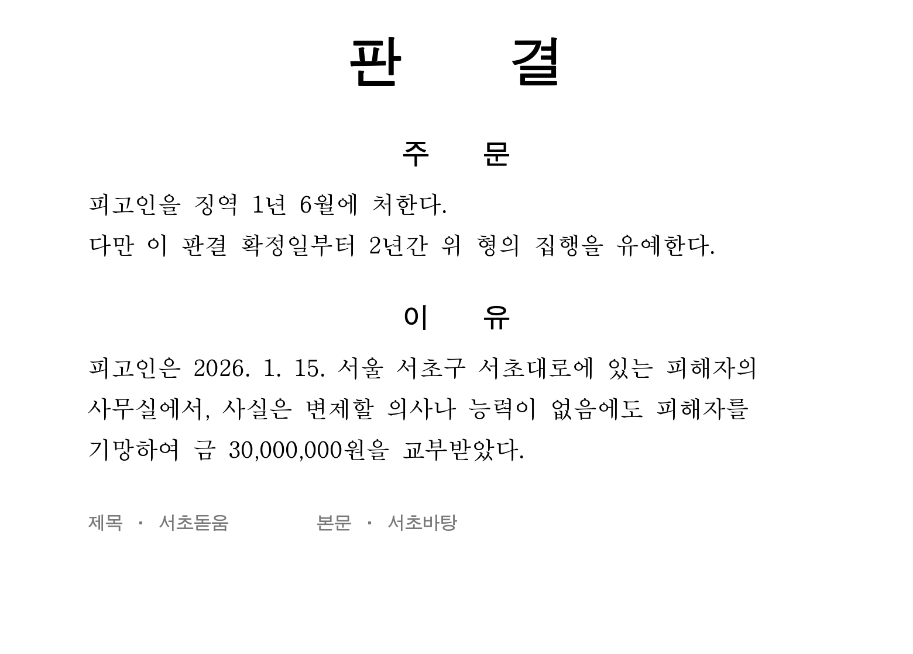
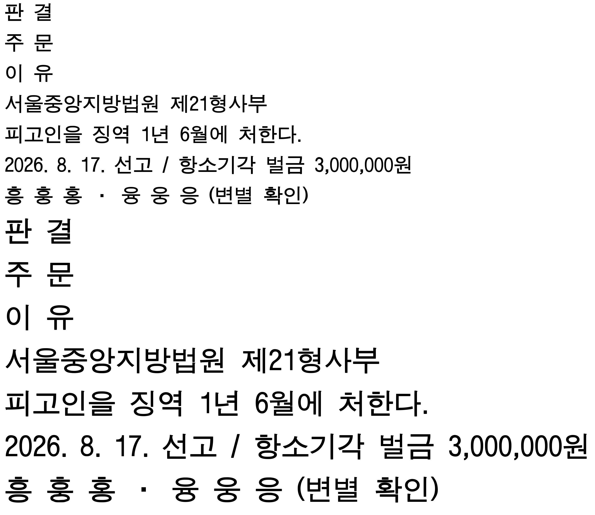

# 서초돋움 (Seocho Dotum)

> **서면의 제목에는 제목의 활자가 있습니다.**

서초돋움은 법원 판결문 표제부의 고딕 인상을 오마주하여 독자적으로
제작한 **무료 한글 제목용 서체**입니다. 법률 서면의 제목과 항목
표제, 관공서 공문서의 제목처럼 굵고 단정한 위계가 필요한 자리를
위해 만들어졌습니다. 이름은 자매 서체 서초바탕과 같이 법률의
중심지 서초동에서 취했습니다.

## 왜 서초돋움인가

- **제목 굵기가 서체에 내장되어 있습니다.** 볼드 버튼을 누르지
  않아도 그대로 제목입니다. 합성 볼드 특유의 획 뭉개짐이 없고,
  ㅎ의 꼭지와 겹받침 사이의 틈까지 살아 있습니다.
- **좁은 폭, 각진 마감의 단단한 골격.** 몇 글자 되지 않는 제목이
  지면 전체의 격을 잡아 줍니다.
- **한글 11,172자 전량 수록.** 어떤 사건명·지명·이름도 깨지지
  않으며, 숫자·문장부호·원문자 등 서면용 기호를 함께 담았습니다.
- **서초바탕과 수직 메트릭을 공유합니다.** 제목(서초돋움)과
  본문(서초바탕)을 한 문서에 섞어도 줄 흐름이 흔들리지 않습니다.
- **밀집 글자 광학 보정.** 획이 많은 글자는 굵기를 미세하게 낮춰
  제목 크기에서도 검게 뭉치지 않습니다.

## 설치

[Releases](../../releases)에서 최신 버전을 내려받으세요.

| OS | 방법 |
|---|---|
| Windows | `SeochoDotum-Regular.ttf` 우클릭 → **설치** |
| macOS | TTF 더블클릭 → **서체 설치** |
| Linux | `~/.local/share/fonts/`에 복사 후 `fc-cache -f` |

웹에서는 `fonts/SeochoDotum-Regular.woff2`를 사용하세요.

## 권장 사용

- 제목·표제: **서초돋움 14~24pt** / 본문: 서초바탕 11~13pt
- 서초돋움에는 **볼드(B)를 추가하지 마세요** — 이미 제목 굵기라서,
  볼드를 더하면 워드프로세서가 획을 합성으로 부풀려 오히려
  뭉개집니다.

## 라이선스

**SIL Open Font License 1.1** — 개인·기업·관공서 어디서나 무료이며,
설치 수·사용 프로그램·문서 임베딩·재배포에 제한이 없습니다.
전문은 [OFL.txt](OFL.txt)를 보세요.

> 서초돋움은 법원의 공식 서체가 아닙니다. 공개된 판결문 지면의
> 표제 자형을 참고하여 독자적으로 제작한 서체이며, 원본 폰트
> 파일의 데이터는 일절 사용하지 않았습니다.

## 자매 서체

본문용 명조 **[서초바탕 (Seocho Batang)](https://github.com/iwantanid/SeochoBatang-Font)** —
판결문 본문의 명조 자형을 오마주한 무료 서체입니다. 서초돋움과
수직 메트릭을 공유하도록 설계되어, 두 서체를 함께 쓰면 판결문
지면의 호흡이 그대로 완성됩니다.
